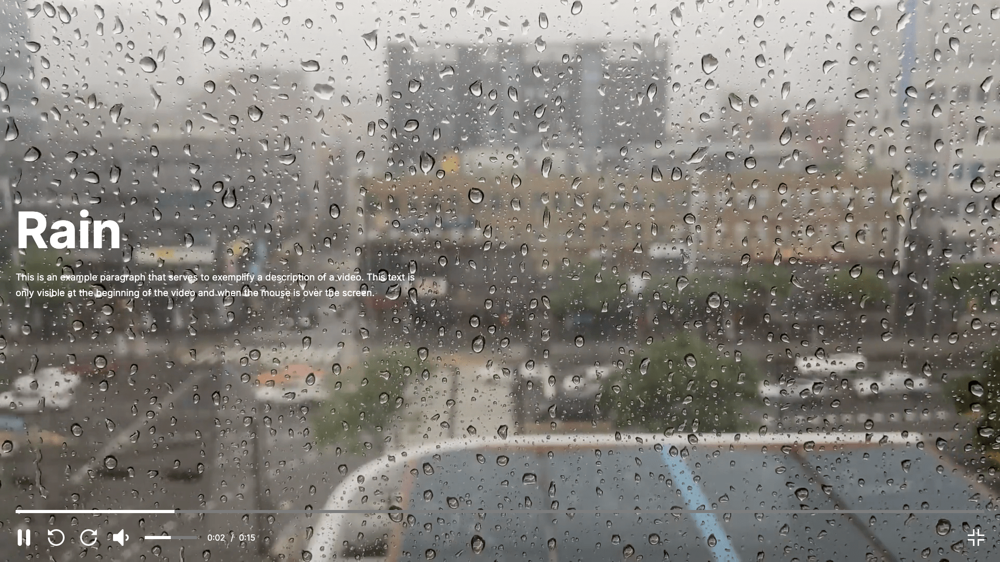

<br />
<p align="center">
  <a href="https://oscarbebop.github.io/video-player/" target="_blank">
    
  </a>

  <h3 align="center">Video Player</h3>

  <p align="center">
    Native video player in html
    <br />
    <br />
    <a href="https://oscarbebop.github.io/video-player/">View Demo</a>
    ·
    <a href="https://github.com/oscarbebop/video-player/issues">Report Bug</a>
    ·
    <a href="https://github.com/oscarbebop/video-player/issues">Request Feature</a>
  </p>
</p>

## About The Project



This is a custom video player for the web built only with html, css and javascript.

The idea of creating this video player is to have an interface that looks the same in most browsers, removing the native players from each browser.

The main functionalities are:

- play video
- pause video
- go back 10 seconds
- fast forward 10 seconds
- audio manipulation
- mute
- video progress manipulation
- full screen

## Supported browsers

Currently this video player is compatible and functional in the following browsers:

- Chrome version 92
- Safari version 14
- Firefox 91

Browsers such as Microsoft Edge or Opera are outside the scope of this development, so some functionalities may not work properly.

## Stack

The stack used in this project is

- HTML 5
- CSS 3
- JavaScript

It does not have any additional library, seeking to work with the minimum amount of technologies

## Getting Started

To be able to use this project on your computer it is only necessary to follow these steps

1. Clone the repo
   ```sh
   git clone https://github.com/oscarbebop/video-player.git
   ```
2. once inside the folder it is only necessary to open the html file
   ```sh
   index.html
   ```

## Contributing

I would like more people to be able to contribute to the development of this repository or help me integrate more languages.

If you want to contribute you can follow the following steps

1. Fork the Project
2. Create your Feature Branch (`git checkout -b feature/AmazingFeature`)
3. Commit your Changes (`git commit -m 'Add some AmazingFeature'`)
4. Push to the Branch (`git push origin feature/AmazingFeature`)
5. Open a Pull Request

## License

Distributed under the MIT License. See `LICENSE` for more information.

## Contact

If you want to contact me you can do it through my twitter account

Twitter - [@oscarbebop](https://twitter.com/oscarbebop)

## Acknowledgements

For the demonstration of this project I have used the following resources:

### Video

[Video by Erick Bang](https://www.pexels.com/video/rainy-day-5100156/)

[License](https://www.pexels.com/license/)

### Music

[Sleepy Cat by Alejandro Magaña](https://mixkit.co/free-stock-music/tag/lo-fi/)

[License](https://mixkit.co/license/#musicFree)

The video used in this project was for educational and demonstration purposes only, and the rights and uses are those of their respective authors.
